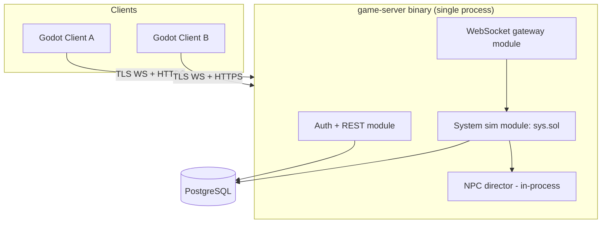
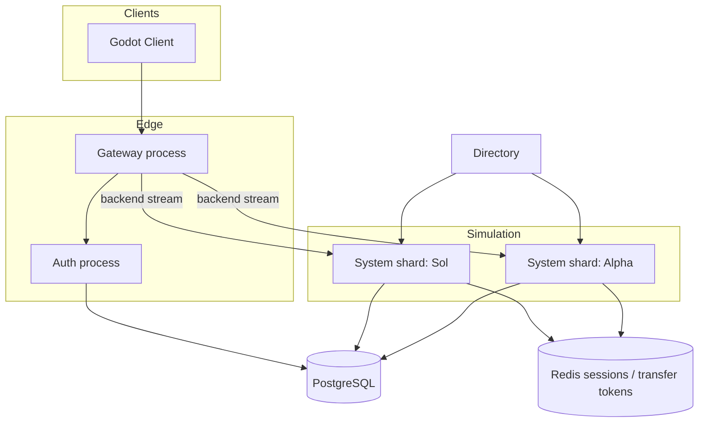
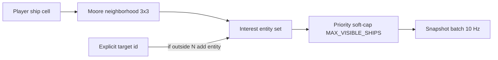
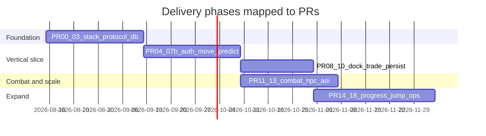

# Design Document: Escape Velocity–Style Top-Down 2D Space MMO

| Field | Value |
|--------|--------|
| **Title** | Nova Horizon — MMO-Capable Top-Down Space Trading & Combat |
| **Author** | Systems Architecture (Draft) |
| **Date** | 2026-08-09 |
| **Status** | Draft |
| **Version** | 0.3 (post-review round 2) |
| **Audience** | Solo / small-team engineers implementing from greenfield |
| **Working title note** | “Nova Horizon” is a placeholder codename. Confirm an original public title before closed beta / marketing (see Risks). Architecture is independent of final product name. |

---

## Overview

**Nova Horizon** (working title) is a greenfield top-down 2D space trading and combat game in the spirit of Ambrosia’s *Escape Velocity* / *EV Nova*: inertial ship flight, multi-system hyperspace travel, commodity markets, docking, missions, factions, and ship progression. Unlike the original single-player titles, the architecture is **online-first and server-authoritative** so the product can grow from a small multiplayer MVP (one star system, 2–16 concurrent players) into a true persistent shared-universe MMO without a rewrite.

The proposed stack optimizes for a solo/small team shipping in months:

| Layer | MVP choice | Scale path |
|-------|------------|------------|
| Client | **Godot 4.x** (GDScript) | Optional web export later |
| Server | **One modular monolith binary** (`game-server`) in **Rust** | Extract multi-process shards when multi-system or load requires it |
| Protocol | **JSON text frames over WebSocket** (schema in `protocol/*.json`) | Optional MessagePack binary later; same schemas |
| Persistence | **PostgreSQL** (sole source of truth for durable state) | Redis optional for multi-instance sessions/transfers |
| World | Star system as logical partition; single system in one process for MVP | One process per system (or multi-system process with isolation) |

Simulation is authoritative on the server; clients render, predict **local ship controls**, and never own inventory, economy, combat outcomes, or transforms. The world is partitioned by **star system** (natural EV sharding unit), with per-system grid AOI so combat density does not force a single global tick for all players.

**Unit system (binding):** all simulation, content, and network coordinates use **abstract world units (wu)** where **1 wu = 1 meter** for mental model and tuning. Do not mix `km` / `m` suffixes in code or content. Prose may say “~3 km” only as a parenthetical convenience; constants and schemas use `wu` only.

---

## Background & Motivation

### Why this game

*Escape Velocity* and *EV Nova* established a durable fantasy: free-form captaincy in a living galaxy—trade routes, pirate interdiction, police response, reputation, and the fantasy of “just one more jump.” Classic EV is offline and single-player; modern players expect persistence, other captains in the same system, shared markets, and fair PvP/PvE. Building multiplayer as a bolt-on after a pure single-player product typically forces a second architecture.

The intended middle path is **shared `crates/sim` + online host first** (authoritative server process from day one), not “full MMO multi-service ops first” and not “single-player only then bolt on netcode.” Local solo later reuses the same sim library (Appendix B).

### Current state

This is a **net-new** project: no existing game codebase, no legacy networking, no prior content pipeline. All interfaces, schemas, and tick models are free to choose for long-term MMO fit and short-term MVP velocity.

### Pain points the architecture must solve

| Pain | Implication |
|------|-------------|
| Inertial 2D combat feels bad under latency | Client prediction + server reconciliation; fixed sim tick |
| Economy exploits in multiplayer | Server-owned markets, transactional trades, rate limits |
| “Everyone in one system” vs MMO scale | System = shard unit; AOI inside system |
| Solo dev scope explosion | Modular monolith + strict MVP; multi-service deferred |
| Trusting the client | Zero trust for money, cargo, damage, mission completion, position |
| Dual-language protocol drift | JSON schema source of truth + golden cross-language tests |

---

## Goals & Non-Goals

### Goals (MVP → MMO path)

1. **Authoritative multiplayer** for movement validation, combat, inventory, docking, and markets.
2. **EV-like flight feel**: thrust, reverse, rotate, momentum, weapons, shields/armor/energy.
3. **Docking + trading** between at least two stations with commodity price tables.
4. **Persistence**: account, character, active ship, outfit, cargo, credits, fuel, last system/position, last-docked station.
5. **Horizontal scale path**: logical system isolation; process-per-system when needed; AOI; gateway routing.
6. **Incremental content**: data-driven systems, stations, commodities, ships, weapons (TOML/JSON).
7. **MVP concurrent target**: 2–16 players in one system; design headroom 50–100 per system **only after AOI + measured tick budget** (sparse trading; combat density is the real limit).
8. **Observability**: structured logs, core multiplayer metrics, basic alerting hooks, MVP runbook.

### Non-Goals (explicitly out of scope for v1 / early roadmap)

- Full EV Nova-scale galaxy, storyline missions, or six faction arcs at launch.
- Cross-system seamless streaming without a jump/load boundary.
- Mobile-first clients; console certification.
- User-generated full plugins with arbitrary code execution (content data packs only).
- Voice chat, complex social guilds, housing, or base building in MVP.
- Fully autonomous offline single-player parity on day one (architecture allows later; not primary).
- Perfect anti-cheat against kernel-level cheats (focus on protocol/economy integrity).
- Blockchain / NFT economies.
- **MVP multi-process mesh** (separate Auth/Gateway/Shard/Directory deploys)—deferred until multi-system or ops need.
- **MVP Redis as market or AOI cache**—Postgres and in-memory shard state only until multi-instance.
- **CDN content patch pipeline** for alpha—same-commit content embed + version string match.
- Missiles, fighters, beam weapons with continuous traces (MVP = hitscan or short ballistic projectiles only).

---

## Key Decisions

| # | Decision | Choice | Rationale |
|---|----------|--------|-----------|
| 1 | Client engine | **Godot 4.x** (GDScript primary) | Excellent 2D, open source, fast iteration, Web export optional, no royalties |
| 2 | Simulation language | **Rust** for `game-server` + `crates/sim` | Safety, performance, Tokio; **Go** remains peer alternative if team prefers |
| 3 | MVP deploy topology | **Modular monolith**: one `game-server` binary (HTTP auth + WS + single-system sim modules) | Solo/small-team velocity; crate boundaries allow later process split |
| 4 | Protocol wire format | **JSON text WebSocket frames for MVP**; schemas in `protocol/*.json` as source of truth | Godot GDScript interop without GDExtension; binary MessagePack later with same schemas |
| 5 | Networking model | **Server-authoritative** + client prediction for **local inputs only** + reconciliation | Fair combat/economy; EV flight needs responsiveness; **server never reads client transform** |
| 6 | World partition | **Star system = primary logical shard** | Matches EV fiction; jump is natural load boundary |
| 7 | Intra-system interest | **Grid AOI** (cell = 3000 wu) | Avoid O(n²) broadcast; required before raising player cap above 16 |
| 8 | Persistence | **PostgreSQL sole durable truth**; Redis **optional** (sessions/presence/transfer tokens when multi-process) | ACID for economy; no Redis market/AOI truth |
| 9 | Tick rates | **20 Hz server** (dt = 0.05 s); client render 60 Hz | 2D ship scale; bandwidth/CPU win |
| 10 | Entity / durable IDs | **UUID v7** for accounts, characters, ships, sessions, **and** runtime entity IDs that map 1:1 to durable ships | One ID space; time-sortable; cross-shard safe; no UUID-vs-ULID split |
| 11 | Content format | **TOML/JSON** ship/outfit/system defs; **version string must match** client/server at join | EV spirit; MVP embed same-commit packs |
| 12 | Auth / long WS | Email+password or magic link; **server-side session record** authorizes connection (not access JWT alone); refresh for REST | Hours-long play sessions |
| 13 | Solo offline later | Local mode reusing `crates/sim` + same protocol to localhost | Online primary; solo is deployment mode |
| 14 | Sim entity store | **Custom minimal store** in `crates/sim` (generational arena / SoA)—not flecs for MVP | Pure Rust tests; low learning curve at 16–few-hundred entities |
| 15 | Units | **1 world unit (wu) = 1 meter** mental model; all schemas use wu | Single consistent system |
| 16 | PvP / safe zones | **No fire and no damage application inside station safe radius**; open PvP beyond (MVP default) | EV-like; reduces undock grief |
| 17 | Death / cargo | On death: **lose 50% of each cargo stack (floor)**; credits kept; **always respawn docked** at `last_docked_station` (or system default) with full shield/armor/energy, 3 s invuln while still docked; ship hull retained; player must undock | Integrity + clear alpha UX |
| 18 | Fuel | **Integer `fuel` on ship**; hyperspace spends `fuel_cost` from link def; **refuel via dedicated station RPC** (`RefuelRequest`), not as cargo commodity | Jump graph is meaningful; simple station service |
| 19 | Energy | **Capacitor `energy` on hull**; weapons spend energy; regen per tick from outfit/hull | Needed for fire authority |
| 20 | Static market arbitrage | **Accepted gameplay** for MVP if spreads are designed content; **finite stock** + **per-character daily trade-volume cap** | Dual-station loop is the MVP; prevent infinite print via stock + cap |
| 21 | Cargo capacity | Hold limit is **mass**: `sum(qty * commodity.mass_per_unit) <= ship.cargo_capacity_mass`; hull `mass` is flight-only (separate) | Unambiguous `InsufficientCargo` |
| 22 | Station identity | **DB stores content string ids** (`st.earth_orbit`); **wire uses UUID v5(STATION_NS, content_id)**; map at protocol boundary | One bridge rule; no dual-key confusion |
| 23 | Combat lock (jump) | **MVP: no combat lock** on hyperspace—remove `InCombatLock`; may add later (`last_damage_tick` within 3 s) | Avoid undefined reject code |
| 24 | Jump fuel ordering | **Reserve dest capacity before fuel debit**; fuel debited only after successful reserve at `PersistedEgress`; any abort after debit **must refund fuel in same compensating TX** | No permanent fuel burn on failed jump |

---

## Proposed Design

### High-level architecture

#### MVP (modular monolith) — implement this first



**MVP process count:** 1× `game-server` + 1× PostgreSQL. Redis is **not required** until multi-process or multi-instance. CDN is static art optional; content packs ship inside client/server builds for alpha.

#### Scale path (multi-process — not day-one deploy)



**Process-split criteria (any one triggers extract):**

1. Second live star system with independent tick isolation desired, **or**
2. Sustained concurrent players approaching soft cap with tick overruns, **or**
3. Need to restart sim without dropping auth/login.

Until then: **in-process function calls** between modules (see Internal APIs).

### Internal APIs

| Boundary | MVP | Multi-process later |
|----------|-----|---------------------|
| Auth ↔ Sim | In-process: `SessionService::attach(character_id) -> Result<AttachHandle>` | HTTP/gRPC attach + shared session store |
| WS gateway ↔ Sim | In-process: channel/mpsc of `ClientCommand` / `ServerEvent` per connection | Gateway holds backend WS or gRPC bidi stream per shard |
| Directory / routing | Hard-coded `sys.sol` → local sim; no Directory service | Directory HTTP: `GET /systems/{id}/endpoint`, capacity |
| NPC director | **In-shard subsystem** (same tick or substep); not a separate worker process | Optional worker only if AI CPU dominates |
| Transfer handoff | In-process state machine + DB row locks (single system: jump may still be designed for multi later) | Redis `transfer:{token}` + Directory reserve |

**NPC Director:** always **in-shard** for MVP. Architecture diagrams must not imply a separate NPC service until a measured need exists.

**Attach session (MVP):** after WS `AuthHello` validates server-side session, gateway module calls `sim.spawn_or_resume(character_id)` directly; returns initial snapshot on the same WS connection.

**Attach session (multi-process):** gateway validates session → Directory resolves system → opens/uses backend stream → `Attach { session_id, character_id, transfer_token? }` RPC → shard loads ship from PG if not in memory.

### Simulation model

#### Fixed timestep

- Server simulation tick: **20 Hz** (dt = 0.05 s).
- Client render: unlocked / 60 Hz with interpolation of remote entities.
- Physics: semi-implicit Euler for 2D ships (point mass + angular velocity).

```text
Server loop (per system sim):
  while running:
    now = clock()
    while accumulator >= TICK:
      process_inputs(TICK)      # validated player intents only
      integrate_physics(TICK)
      resolve_weapons_and_damage(TICK)
      run_npc_director(TICK)
      update_docking_and_stations(TICK)
      recompute_aoi_cells()
      interest_and_replicate()
      accumulator -= TICK
      if tick_time > TICK: metrics.tick_overrun++
    sleep_until_next()
```

#### Entity model (`crates/sim` — custom store)

**Decision:** generational arena of entities + component arrays (or a thin custom ECS). **Do not** adopt flecs for MVP unless composition complexity explodes later.

| Component | Used by | Notes |
|-----------|---------|-------|
| `Transform2D` | ships, projectiles, stations | `pos: Vec2` (wu), `rot: f32` (radians) |
| `Velocity` | ships, projectiles | linear (wu/s) + angular (rad/s) |
| `ShipDefId` | ships | content id string |
| `OutfitLoadout` | ships | weapons, engines, shields |
| `HullState` | ships | shield, armor, energy, invuln_until_tick |
| `Fuel` | ships | integer jumps-worth or units |
| `CargoHold` | ships | commodity stacks; mass used = sum(qty × mass_per_unit) vs `cargo_capacity_mass` |
| `Pilot` | ships | `character_id: Uuid` or NPC brain id |
| `DurableShipId` | player ships | **same UUID v7** as `ships.id` in PG |
| `FactionRep` | characters (not every tick) | loaded with pilot |
| `DockedState` | ships | `Option<station_content_id>` |
| `LastDocked` | ships | station content id for respawn |
| `AoiCell` | mobiles | `(cx, cy)` derived from position |
| `Projectile` | shots | owner entity, weapon def, lifetime, damage, velocity |
| `Npc` | stations | content id, safe radius wu |

**Entity ID policy (binding):**

- Durable player ships: **`ships.id` UUID v7** is the runtime entity id (1:1).
- **Stations (bridge rule — Key Decision #22):**
  - **Content / DB key:** stable string id, e.g. `st.earth_orbit`. Columns `station_markets.station_id`, `ships.docked_station`, `ships.last_docked_station`, and content packs always use this string.
  - **Wire / runtime entity id:** `UUID v5(STATION_NAMESPACE, content_id)` where `STATION_NAMESPACE` is a fixed UUID constant checked into `protocol/` / `crates/protocol` (define in PR-02). Example: `uuid_v5(STATION_NS, "st.earth_orbit")`.
  - **Protocol boundary:** inbound messages (`DockRequest.station_id`, `TradeExecute.station_id`, `RefuelRequest.station_id`) carry UUID → server resolves to content string before DB/sim lookups; outbound (`EntitySpawn`, `StationMenu`, `DockResult`) set `id` = v5 UUID and `def_id` = content string so clients can display without reverse-mapping tables.
  - Do **not** store wire UUIDs in market or docked columns.
- Projectiles / transient NPC ships: UUID v7 allocated at spawn; NPCs that persist (none in MVP) would get durable rows.
- Client only learns IDs via server spawn messages.

#### Unit system (binding)

| Quantity | Unit | Example |
|----------|------|---------|
| Position, radius, range | **wu** (1 wu ≈ 1 m) | system radius `120_000` wu (~120 km) |
| Linear velocity | **wu/s** | cruise ~400–800 wu/s (tune) |
| Acceleration / thrust effect | **wu/s²** | from engine def |
| Angular | **radians**, **rad/s** | — |
| Hull mass | abstract mass units | flight inertia feel only (`ship.mass`) — **not** cargo |
| Cargo mass | abstract mass units | `commodity.mass_per_unit`; hold uses `cargo_capacity_mass` |
| Prices / credits | integer credits | — |
| Fuel | integer fuel units | link `fuel_cost`; station `fuel_price_per_unit` |
| Energy | abstract energy points | weapon `energy_cost` |
| Hull radius | **wu** | `ship.hull_radius_wu` for hitscan circle tests |

**Content and constants must use `wu` suffixes or unitless numbers documented as wu—never `_km` or `_M` in the same codebase.**

#### Flight model (EV-like)

- Thrust along ship forward; reverse thrusters at reduced accel.
- Rotation rate limited by engine outfit.
- Space is effectively frictionless; optional tiny drag only if tuning requires (default **off**).
- Soft speed cap via engine `max_speed` (wu/s).
- **Server integrates from inputs only.** Any client-reported position/velocity is ignored if ever present (MVP messages do not include them on input).

#### Docking rules (server validation)

Constants in Appendix C.

A `DockRequest { station_id }` (wire UUID v5) succeeds only if **all** hold:

1. Ship is not dead / not already docked.
2. Station UUID maps to a content id that exists in this system and is dockable.
3. Distance(ship, station dock point) ≤ `DOCK_RANGE_WU` (default 400 wu).
4. Speed ≤ `DOCK_MAX_SPEED_WU_S` (default 80 wu/s).
5. Optional MVP: not required to align heading.
6. Optional MVP: **allow dock even if in combat** (simpler); v1.1 may require out-of-combat.

On success:

- Set `docked_station` and `last_docked_station` to station **content string id** (not wire UUID).
- Clear velocity and angular velocity.
- Stop weapon fire; cancel hyperspace channel.
- Persist docked state soon after.

`UndockRequest`:

- Must be docked; clear docked flag; spawn at station undock lane offset; apply small safe impulse along lane heading; brief invuln (1 s) optional.

Reject codes: `TooFar`, `TooFast`, `AlreadyDocked`, `NotDocked`, `Dead`, `InvalidStation`, `WrongSystem`.

#### Combat authority

1. Client sends **inputs** only (`thrust`, `turn`, `fire_mask`, `target_id`)—never hit events or transforms.
2. **Safe zone:** if shooter **or** target is within `STATION_SAFE_RADIUS_WU` of any station dock point, **ignore fire** and **apply no damage** (projectiles despawn or never spawn).
3. Server spends energy (`weapon.energy_cost`), enforces `cooldown_s`, fires hitscan (MVP default) or short-lived projectiles.
4. Hits resolved only on server.
5. Damage: shields then armor; at armor ≤ 0 → death.
6. **Death (MVP default):**
   - Emit `EventCombat { kind: Death }`.
   - Apply cargo loss: each stack `qty = floor(qty * 0.5)` (remove if 0).
   - Credits unchanged; fuel unchanged (**keep fuel as-is**).
   - Despawn wreck; after short delay, **always respawn docked** at `last_docked_station` (content id), or system default station if never docked. Set `docked_station = last_docked_station`, clear space velocity, restore full shield/armor/energy, `invuln` for `RESPAWN_INVULN_S` (3 s) after next undock begins (or while docked—harmless). **No undocked-in-lane respawn** in MVP; leaving the station is always a player `UndockRequest`.
7. Clients may show local muzzle VFX immediately; server `EventCombat` is truth for hits/death.
8. **Out of MVP:** missiles, fighters, continuous beams, friendly-fire toggles beyond safe zones, combat-lock on hyperspace.

#### Projectile & VFX replication (MVP algorithm)

**Weapon model MVP:** prefer **hitscan** (instant ray) for primary guns to cut entity traffic. Optional **ballistic** projectiles if travel time is a design need (lifetime ≤ 2 s). Weapon defs live in `content/weapons/*.toml` and are referenced from ship outfit loadout slots.

**Hitscan path:**

1. On fire: if energy ≥ `energy_cost` and cooldown ready, debit energy and cast a ray from ship nose along aim/forward up to weapon `range_wu`.
2. **Hit test:** among hostile ships whose disc (center = ship position, radius = target `hull_radius_wu` from ship def) intersects the segment, pick the **closest** intersection distance; apply `damage` to that target. No intersection → `Miss`.
3. No projectile entity required for hitscan.
4. Broadcast `EventCombat { kind: Hit|Miss|ShieldBreak, source, target?, pos, weapon_def }` to AOI interested in source and target cells.

**Ballistic path (if used):**

1. Spawn projectile entity with velocity; integrate each tick; destroy on hit or lifetime.
2. **AOI for projectiles:** replicate spawn/despawn only to clients who already have **owner or target** (or projectile cell) in their interest set. Do **not** full-snapshot projectiles at 10 Hz—send `ProjectileSpawn` + periodic sparse update only if lifetime > 0.5 s.
3. Clients may predict local projectiles for juice; on `EventCombat` or missing ack, correct.

**Client VFX:** local predicted muzzle flash always; remote ships fire VFX from `EntitySnapshot.flags` or `EventCombat`.

### Interest management (AOI algorithm)



**Grid:**

- Cell size `AOI_CELL_WU = 3000`.
- On each integrate, `cell = (floor(pos.x / CELL), floor(pos.y / CELL))`.
- Interest cells = all cells with Chebyshev distance ≤ 1 from ship cell (3×3).
- **Stations:** if distance to station < `SCANNER_RANGE_WU` (e.g. 20_000), include station at low rate (2 Hz) even if outside 3×3.

**Enter/leave:**

- Diff previous interest set vs new; send `EntityDespawn` for left; `EntitySpawn` + full baseline for entered.
- Boundary thrash: only recompute subscription when cell **changes** (not every tick while jittering inside cell).

**Target expansion:** if `target_id` is set and entity exists in system, force-include that entity even outside 3×3 (range-limited to `TARGET_LOCK_RANGE_WU`, default 15_000).

**Priority when over `MAX_VISIBLE_SHIPS` (96):**

```text
score(entity) =
  +1000 if in combat with local player (damaged or damaged by within 5 s)
  +500  if local player target
  +100  if player ship (not NPC)
  +50   if recently damaged (any)
  -distance_wu / 1000
Keep highest scores; despawn rest from that client's view.
```

**Pre-AOI (PR-07 era):** always-relevant replication allowed **only** while:

- Players ≤ 16, and
- `MAX_PROJECTILES_GLOBAL ≤ 64`, and
- `MAX_NPCS_SYSTEM ≤ 24`.

**AOI is required before raising player cap above 16.**

#### Bandwidth sketches

**Sparse (trade):** 30 ships × 10 Hz × ~64 B ≈ 19 KB/s downlink before compression—fine.

**Combat-dense (MVP stress):** 16 players + 20 NPCs in overlapping cells + ~30 hitscan events/s:

- 36 mobiles × 10 Hz × 64 B ≈ 23 KB/s snapshots
- SelfState 20 Hz × ~80 B ≈ 1.6 KB/s
- Events ~30 × 40 B ≈ 1.2 KB/s  
**Total ~25–30 KB/s** per client in the scrum—acceptable on broadband.  
If ballistic projectiles are enabled naively at full snapshot rates, costs climb quickly—hence hitscan default.

**Optional later:** quantize positions to mm-scale ints; delta compression—own PR after metrics say so.

**50–100 players/system:** design **headroom for sparse** traffic only; undock scrums will hit tick CPU before bandwidth. Split/overflow only after measuring tick time with projectiles/NPC caps.

### Netcode contract

Binding rules for implementers:

1. **Server never applies client transforms.** `InputFrame` contains controls only. There is no legal client → server position field in MVP.
2. **Server integrates** at 20 Hz from last controls (or zeros if no recent input).
3. **`SelfState` every sim tick (20 Hz)** to owning client, including `last_processed_input_seq`, full transform, velocity, hull, energy, fuel, docked flag.
4. **Client prediction:** apply local inputs immediately to a predicted ship; keep a ring of inputs for **at least 1.0 s** (≥ 20 samples; recommend 32–40). `MAX_INPUT_AGE_MS = 250` is the **server** drop window for late inputs—not the client ring size.
5. **Reconciliation:** when `SelfState` arrives, if predicted pos error > `RECONCILE_EPSILON_WU` (e.g. 2.0) **or** rot error > epsilon, snap/blend to server state and **replay** unprocessed inputs with seq > `last_processed_input_seq`.
6. **Input acceptance (server):** drop if `seq <= last_seq`, or `seq` jumps more than `INPUT_SEQ_JUMP_MAX` (e.g. 40), or timestamp age > 250 ms if client clock offset known; clamp axes to [-1, 1]; ignore fire if dead/docked/safe-zone/no energy.
7. **Clock sync:** on join, `ClockSyncRequest` / `ClockSyncResponse` with server time once (and optionally every 30 s). Used for diagnostics and late-input heuristics—not for trusting client time for combat.
8. **Remote entities:** interpolate between last two snapshots; buffer ~100 ms; extrapolate ≤ 100 ms if gap.
9. **Rejected / failed shots:** no energy or cooldown → silent or `EventCombat { kind: FireDenied, reason }`; client cancels predicted tracer if denied.
10. **Reliable gameplay RPCs:** request/response with `request_id` (UUID v7 or u64); not envelope ack over TCP.

### Session, auth lifecycle, and hyperspace handoff

#### Long-lived WebSocket auth

- REST login issues: `access_jwt` (short, 15 min, for HTTP) + `refresh_token` + **`session_id`** stored server-side (`sessions` row; optional Redis mirror when multi-instance).
- WS `AuthHello` sends `session_id` + `refresh_token` (or one-time connect ticket minted at login). Gateway checks **session row**: not expired, not revoked, character allowed, `banned_until`.
- **Connection remains authorized by session record**, not by access JWT expiry. Access JWT may expire mid-fight without dropping WS.
- Periodic (e.g. every 60 s) recheck `banned_until` and session revoked flag; force disconnect with `ServerNotice`.
- **One live game session per character:** unique partial index / Redis lock; second connect **kicks** the first or rejects with `AlreadyOnline` (MVP: **kick previous**).
- Optional `AuthRefresh` on WS to rotate refresh token; not required every 15 min for combat continuity.

#### Hyperspace handoff protocol (failure-aware)

Even with a monolith, implement the FSM so multi-process extraction does not redesign jump integrity. Single-process multi-system mode still uses the same states.

**MVP jump eligibility (validation before channel):**

- Ship not docked, not already jumping, has a content link to `dest_system_id`, `fuel >= link.fuel_cost`.
- **No combat lock in MVP** (Key Decision #23). Do not reject for recent damage or open weapons fire. (Future optional: `last_damage_tick` within 3 s → `InCombatLock`—not implemented until designed.)

**Binding fuel / reserve order (Key Decision #24):**

```text
Reserve dest capacity AND confirm dest is accepting joins
  → only then debit fuel and mark PersistedEgress
Never debit fuel before a successful reserve.
If any path aborts after fuel was debited, refund fuel in the same compensating transaction (invariant: failed jump never permanently consumes fuel).
```



```mermaid
stateDiagram-v2
  [*] --> Idle
  Idle --> JumpPending: HyperspaceRequest accepted (fuel checked, not debited)
  JumpPending --> IngressReserved: dest capacity reserved + dest alive
  JumpPending --> Idle: validate fail / cancel / channel interrupt
  IngressReserved --> PersistedEgress: final save + fuel debit in one TX
  IngressReserved --> Idle: reserve lost/timeout before debit\n(release reserve; fuel never debited)
  PersistedEgress --> TokenIssued: transfer token minted
  TokenIssued --> Spawned: ingress applied ship in dest
  TokenIssued --> AbortRefund: ingress timeout / dest dies after debit
  PersistedEgress --> AbortRefund: unexpected abort after debit
  AbortRefund --> Idle: refund fuel + release reserve + clear jump_state
  Spawned --> EgressPurged: source removes ship
  EgressPurged --> Idle: complete
```

**States & fields (DB or in-memory + DB mirror):**

| State | Meaning | Durable marker |
|-------|---------|----------------|
| `Idle` | Normal play | `ships.jump_state = null` |
| `JumpPending` | Channeling; ship locked from second jump; **fuel not yet debited** | `jump_state=pending`, dest id, deadline |
| `IngressReserved` | Dest capacity seat held; **fuel still not debited** | reservation row / memory with TTL |
| `PersistedEgress` | Source has written final pos/cargo **and fuel debit** | `jump_state=persisted_egress` |
| `TokenIssued` | Single-use token for attach | `transfer_tokens` row TTL 30 s |
| `Spawned` | Ship exists in dest sim | dest has entity; source must purge |
| `EgressPurged` | Source no longer has entity | `jump_state=null`, `system_id=dest` |
| `AbortRefund` | Transient compensating path | not stored long; ends in `Idle` |

**Invariants:**

1. **Single-writer character lock:** `SELECT … FOR UPDATE` on `characters` (or `ships`) for the jump transaction so two jumps cannot interleave.
2. **Fuel debit ordering:** fuel is **never** debited before `IngressReserved` succeeds. Fuel is debited **exactly once** when entering `PersistedEgress` (same TX as final egress save). **Failed-jump refund invariant:** any abort after debit (`TokenIssued` timeout, dest death, operator unstick mid-flight, etc.) **must refund `fuel_cost` in the compensating TX** before clearing `jump_state`. Net effect of a failed jump on fuel is zero.
3. **Ship must not be fully active in two sims.** Brief dual existence is forbidden: source keeps ship in `JumpPending` / `IngressReserved` / `PersistedEgress` / `TokenIssued` (non-interactive, invulnerable, ghost) until `EgressPurged`; dest spawns only after token accept.
4. **Token:** UUID v7, single-use, TTL 30 s, payload: `{ character_id, ship_id, dest_system, cargo_hash, fuel_after_debit, credits_snapshot_version }`.
5. **Idempotency:** applying the same token twice is a no-op success if already `Spawned` for that token.
6. **Client connection:** MVP monolith keeps the **same WS**; server sends `JumpCountdown` then `JumpArrive` with new system snapshot. Multi-process: prefer gateway-proxied backend switch; optional `ReconnectTo { host, token }`.

**Failure table:**

| Failure | Detection | Compensation |
|---------|-----------|--------------|
| Dest full / refuse reserve | Reserve fails **before** debit | Stay `Idle` or cancel `JumpPending`; **fuel never debited**; notify `JumpRejected.Full` |
| Dest process down before reserve | Health check / reserve timeout | Cancel channel; **fuel never debited**; `JumpRejected.DestDown` |
| Dest dies after reserve, before debit | Reserve TTL / heartbeat | Release reserve; return `Idle`; **fuel never debited** |
| Dest dies / ingress fails **after** debit | Token TTL, attach fail, dest crash while `persisted_egress` | **`AbortRefund`:** refund `fuel_cost`, release reserve, rehydrate ship interactive on source (jump lane or last safe), clear `jump_state`; notify player |
| Source crash after debit before purge | On source boot: `persisted_egress` / `token` rows | Query dest: if ship active there → purge source (no refund); if not → **refund fuel** + rehydrate source **or** complete ingress if dest can still accept token |
| Client never arrives | Token TTL | Expire token; dest releases reserve; **refund fuel** if ship not successfully spawned on dest; rehydrate source |
| Double spend cargo | Version/hash on cargo in token vs DB | Reject ingress; `jump_state=limbo`; ops unstick (**refund fuel** if dest did not take ship) |

**Stuck-in-limbo recovery (ops):** runbook lists `jump_state != null` older than 2 minutes; unstick forces docked at `last_docked_station`, clears jump fields, and **refunds fuel if dest never applied the transfer** (check `transfer_tokens.consumed_at` / dest presence).

Happy-path sequence (monolith or multi):

```mermaid
sequenceDiagram
  participant C as Client
  participant GS as game-server
  participant PG as PostgreSQL

  C->>GS: HyperspaceRequest(dest)
  GS->>GS: validate link, fuel >= cost, not docked, not already jumping
  GS->>GS: reserve dest seat (capacity + alive)
  alt reserve fails
    GS->>C: JumpRejected Full or DestDown
  else reserve ok
    GS->>C: JumpCountdown (channel)
    GS->>PG: BEGIN lock ship; save pos/cargo; debit fuel; jump_state=persisted_egress; COMMIT
    GS->>GS: mint single-use token
    GS->>GS: spawn dest; purge source; jump_state=null; system_id=dest
    GS->>C: JumpArrive + snapshot
  end
```

### Economy

- Each station has a **market table** in **Postgres only** (MVP): commodity → stock, buy price, sell price, restock parameters. **`station_id` is the content string** (e.g. `st.earth_orbit`), never the wire UUID.
- Prices static tables for MVP; later: supply/demand at 1/min ticks still in PG.
- **No Redis market cache in MVP** (avoids stale-price-as-truth bugs).
- Trades are **DB transactions** with explicit **lock order** (see Data Model). Wire `station_id` UUID is mapped to content string at the handler boundary before SQL.

#### Cargo mass semantics (Key Decision #21)

- Each commodity def has **`mass_per_unit`** (abstract mass units, same unit system as hold capacity).
- Each ship def has **`cargo_capacity_mass`** (not a slot count).
- On buy / loot / transfer: allow only if  
  `sum_over_stacks(quantity * mass_per_unit) + added <= ship.cargo_capacity_mass`.
- Otherwise `TradeResult.code = InsufficientCargo`.
- Ship **`mass`** (hull dry mass) is **flight-feel only** (inertia / tuning); it does **not** change with cargo in MVP (optional later: effective mass = hull + cargo).

#### Refuel path (Key Decision #18)

Fuel is **not** a cargo commodity and is **not** bought via `TradeExecute`.

- Station content defines `fuel_price_per_unit` (credits per fuel integer) and optional `fuel_available` (or unlimited for MVP).
- While docked, client sends `RefuelRequest`; server charges credits, increases `ships.fuel` up to ship/outfit max (default from hull `starting_fuel` max or explicit `max_fuel` on ship def).
- Ledger kind: `refuel`. Daily trade volume cap **does not** apply to refuel (separate optional daily fuel spend cap later if abused).

#### Market arbitrage controls

- **Static dual-station arbitrage:** accepted as core gameplay if price spreads are intentional content. Mitigations against infinite print:
  1. **Finite stock** + slow restock,
  2. **`daily_trade_volume_cap`** per character (e.g. sum of qty×price ≤ 50_000 credits/day),
  3. Rate limit trades (2/s).
- Multi-boxing: log same-IP multi-character profit; soft limit is the daily cap (shared per account optional later).

### NPC & world living feel (MVP-lite)

- Spawn tables per system: merchants on lanes, pirates in belts, police near stations.
- Simple FSM: patrol → engage → flee at low hull.
- Caps: `MAX_NPCS_SYSTEM = 24` until AOI proven; density caps per AOI cell (e.g. 12 mobiles).

### Client architecture (Godot)

```text
Client/
  net/          # WS client, JSON codec from protocol schemas, request_id correlator
  sim_proxy/    # predicted local ship, input ring, reconciliation
  world/        # entities as nodes
  ui/           # HUD, station UI, map
  content/      # mirrored def ids for presentation (same version string)
```

### Content versioning (MVP vs later)

| Phase | Policy |
|-------|--------|
| **MVP / friends alpha** | Content packs **embedded** in client export and server binary from **same git commit**. `ContentManifest.version` string exchanged at join; **mismatch → refuse join** with `ContentMismatch`. No CDN. |
| **Closed beta+** | `GET /content/manifest` + CDN download of packs; server still rejects unknown def ids. |

### MVP scope (first shippable multiplayer slice)

| Feature | MVP | Later |
|---------|-----|-------|
| Deploy | 1× game-server + Postgres | Multi-process shards, Redis, Directory |
| Systems | 1 | Many + jump graph |
| Stations | 2 | Dozens |
| Players | 2–16 (AOI before >16) | 50–100 / system if measured |
| Combat | Hitscan guns + shields/armor/energy + pirates | Missiles, fighters, beams |
| Economy | 4–6 commodities, static prices, finite stock, daily cap | Dynamic markets |
| Progression | Credits, 2–3 ships, few outfits | Full shipyard, reputations |
| Missions | None or 1 courier | Full mission board |
| Chat | Optional stretch | Channels |
| Protocol | JSON/WS | MessagePack optional |
| Content | Same-commit version match | CDN patch |

**Success criteria:** four friends can undock, dogfight pirates, dock, buy/sell between two stations, log out and keep credits/cargo, rejoin.

### Quantified targets

| Metric | Target |
|--------|--------|
| Server sim tick | 20 Hz |
| Input send rate | 20 Hz |
| SelfState rate | 20 Hz |
| Snapshot rate (AOI) | 10 Hz baseline |
| RTT budget | < 80 ms ideal; playable < 150 ms |
| Players per system (MVP) | 16 hard until AOI proven |
| Players soft/hard design | 50 / 100 after measurement |
| AOI cell | 3000 wu |
| Interest | 3×3 cells + target expand |
| Disconnect grace | 45 s |
| Hyperspace channel | 4 s |
| Trade TX p99 | < 50 ms internal |

---

## API / Interface Changes

### Protocol source of truth & Godot interop

**Key Decision #4 expanded:**

1. Check in **`protocol/json/*.json`** (JSON Schema) or equivalent **`protocol/messages/*.json` examples + `protocol/schema.md`** defining every MVP message.
2. **Rust:** `serde` structs in `crates/protocol` hand-written or codegen from schema; `serde_json` for wire.
3. **Godot:** GDScript dictionaries/classes hand-synced to the same field names; optional small codegen script later.
4. **Golden tests:** `crates/protocol` fixtures encode → JSON bytes; a CI step (and Godot headless or Python) decodes and asserts equality. PR-02 must not merge without at least one cross-check fixture.
5. Wire: WebSocket **text frames**, payload = one JSON object: `{ "t": "InputFrame", "v": 1, ...fields }` **or** `{ "t": "InputFrame", "v": 1, "p": { ... } }`. Pick envelope form in PR-02; recommend **flat with `t` + `v` discriminant**.
6. **Binary later:** MessagePack with same field names; feature-flagged. Not MVP.

### Transport framing (MVP WebSocket)

WebSocket over TLS is **TCP: ordered, reliable**. Do **not** build a UDP-style reliability layer on top for MVP.

| Field | MVP use |
|-------|---------|
| Message type `t` | Discriminant string or int |
| Schema version `v` | Protocol version |
| `request_id` | On RPCs (trade/dock/jump) for response correlation |
| `input_seq` | On `InputFrame` / `SelfState.last_processed_input_seq` only |

**Dropped from MVP envelope:** transport-level `sequence`/`ack` for retransmit (redundant with TCP). May reappear for future QUIC datagram paths.

**Application policies:**

- Movement: latest input wins; old `input_seq` ignored.
- Trade/dock/jump: at-least-once client send OK; server idempotent via `request_id` where needed.

### MVP message field schemas

Types: `Uuid` = string UUID v7; `f32`/`f64` JSON numbers; `wu` = f64 world units.

#### Client → server

```text
AuthHello {
  t: "AuthHello",
  v: 1,
  session_id: Uuid,
  connect_ticket: string,      // or refresh_token material
  client_content_version: string,
  client_protocol_v: u16
}

ClockSyncRequest {
  t: "ClockSyncRequest",
  v: 1,
  client_send_ms: u64
}

InputFrame {
  t: "InputFrame",
  v: 1,
  input_seq: u32,
  thrust: f32,              // [-1, 1]
  turn: f32,                // [-1, 1]
  fire_mask: u32,           // bit0 = primary, etc.
  target_id: Uuid | null
  // NO position, velocity, or damage fields
}

DockRequest {
  t: "DockRequest",
  v: 1,
  request_id: Uuid,
  station_id: Uuid
}

UndockRequest {
  t: "UndockRequest",
  v: 1,
  request_id: Uuid
}

TradeExecute {
  t: "TradeExecute",
  v: 1,
  request_id: Uuid,
  station_id: Uuid,           // wire: UUID v5; server maps → content string
  commodity_id: string,
  side: "buy" | "sell",
  quantity: u32             // > 0
}

RefuelRequest {
  t: "RefuelRequest",
  v: 1,
  request_id: Uuid,
  station_id: Uuid,           // wire UUID v5 → content string
  mode: "fill" | "quantity",
  quantity: u32 | null        // required if mode=quantity; ignored if fill
}

HyperspaceRequest {
  t: "HyperspaceRequest",
  v: 1,
  request_id: Uuid,
  dest_system_id: string
}

ChatSend {                  // stretch
  t: "ChatSend",
  v: 1,
  request_id: Uuid,
  channel: "system",
  text: string              // max 256 chars
}
```

#### Server → client

```text
AuthOk {
  t: "AuthOk",
  v: 1,
  character_id: Uuid,
  ship_id: Uuid,
  system_id: string,
  content_version: string,
  server_protocol_v: u16,
  server_time_ms: u64
}

AuthFail {
  t: "AuthFail",
  v: 1,
  code: "InvalidSession" | "Banned" | "AlreadyOnline" | "ContentMismatch" | "ProtocolMismatch",
  message: string
}

ClockSyncResponse {
  t: "ClockSyncResponse",
  v: 1,
  client_send_ms: u64,
  server_recv_ms: u64,
  server_send_ms: u64
}

SelfState {
  t: "SelfState",
  v: 1,
  tick: u64,
  last_processed_input_seq: u32,
  x: f64, y: f64,           // wu
  rot: f32,                 // radians
  vx: f64, vy: f64,         // wu/s
  omega: f32,
  shield: f32,
  armor: f32,
  energy: f32,
  fuel: u32,
  credits: u64,             // optional periodic; or only on change via EventEconomy
  docked_station_id: Uuid | null,
  invuln: bool,
  flags: u32
}

EntitySpawn {
  t: "EntitySpawn",
  v: 1,
  id: Uuid,
  kind: "ship" | "station" | "projectile",
  def_id: string,
  x: f64, y: f64, rot: f32,
  pilot_name: string | null,
  faction_id: string | null
}

EntityDespawn {
  t: "EntityDespawn",
  v: 1,
  id: Uuid,
  reason: "aoi" | "death" | "dock" | "jump" | "lifetime"
}

EntitySnapshot {
  t: "EntitySnapshot",
  v: 1,
  tick: u64,
  entities: [{
    id: Uuid,
    x: f64, y: f64, rot: f32,
    vx: f64, vy: f64,       // optional compress later
    shield_frac: f32,       // 0..1 for others
    flags: u32              // thrusting, firing, invuln, ...
  }]
}

EventCombat {
  t: "EventCombat",
  v: 1,
  kind: "Hit" | "Miss" | "Death" | "ShieldBreak" | "FireDenied",
  source_id: Uuid | null,
  target_id: Uuid | null,
  weapon_def: string | null,
  x: f64, y: f64,
  damage: f32 | null,
  reason: string | null     // for FireDenied
}

DockResult {
  t: "DockResult",
  v: 1,
  request_id: Uuid,
  ok: bool,
  code: "Ok" | "TooFar" | "TooFast" | "AlreadyDocked" | "Dead" | "InvalidStation" | ...,
  station_id: Uuid | null
}

StationMenu {
  t: "StationMenu",
  v: 1,
  station_id: Uuid,           // wire UUID v5
  def_id: string,             // content id, e.g. st.earth_orbit
  services: ["market", "shipyard", "refuel"],
  fuel_price_per_unit: u32,
  fuel_max_purchase: u32 | null,
  market: [{ commodity_id, stock, buy_price, sell_price, mass_per_unit }]
}

TradeResult {
  t: "TradeResult",
  v: 1,
  request_id: Uuid,
  ok: bool,
  code: "Ok" | "InsufficientFunds" | "InsufficientStock" | "InsufficientCargo" |
        "NotDocked" | "InvalidItem" | "RateLimited" | "DailyCap" | "StaleMarket" | "Internal",
  credits: u64 | null,
  cargo: [{ commodity_id, quantity }] | null,
  cargo_mass_used: f64 | null,
  cargo_capacity_mass: f64 | null,
  market_version: u64 | null
}

RefuelResult {
  t: "RefuelResult",
  v: 1,
  request_id: Uuid,
  ok: bool,
  code: "Ok" | "NotDocked" | "InsufficientFunds" | "Full" | "Unavailable" |
        "InvalidStation" | "RateLimited" | "Internal",
  fuel: u32 | null,
  credits: u64 | null,
  units_bought: u32 | null
}

JumpCountdown {
  t: "JumpCountdown",
  v: 1,
  request_id: Uuid,
  dest_system_id: string,
  seconds: f32
}

JumpArrive {
  t: "JumpArrive",
  v: 1,
  system_id: string,
  x: f64, y: f64, rot: f32
  // followed by full respawn snapshots
}

JumpRejected {
  t: "JumpRejected",
  v: 1,
  request_id: Uuid,
  // MVP: no InCombatLock (Key Decision #23). Reserved for post-MVP if enabled.
  code: "NoFuel" | "NoLink" | "Full" | "DestDown" | "AlreadyJumping" | "Docked" | "Cancelled"
}

ServerNotice {
  t: "ServerNotice",
  v: 1,
  level: "info" | "warn" | "error",
  code: string,
  message: string
}
```

### REST (auth / admin; same binary MVP)

- `POST /auth/register`, `POST /auth/login`, `POST /auth/refresh`
- `GET /characters`, `POST /characters`
- `GET /content/manifest` → `{ version, defs_hash }` (MVP: version only)
- Admin (localhost / mTLS later): ban, market reset, `unstick_transfer`

### Input application (server)

```rust
fn apply_input(ship: &mut Ship, input: &InputFrame, dt: f32, defs: &Content, stations: &[Station]) {
    // Never read client position. Integrate only.
    if ship.docked.is_some() || ship.is_dead() { return; }
    let eng = defs.engine(&ship.loadout.engine);
    let thrust = eng.thrust * input.thrust.clamp(-1.0, 1.0);
    let turn = eng.turn_rate * input.turn.clamp(-1.0, 1.0);
    ship.omega = turn;
    ship.vel += angle_to_vec(ship.rot) * thrust * dt;
    ship.vel = limit_speed(ship.vel, eng.max_speed);
    if input.fire_mask != 0 && !in_safe_zone(ship, stations) {
        try_fire(ship, input.fire_mask, input.target_id, defs, stations);
    }
}
```

---

## Data Model Changes

### PostgreSQL (authoritative durable state)

```sql
-- MVP schema (revised)

CREATE TABLE accounts (
  id            UUID PRIMARY KEY,  -- UUID v7
  email         CITEXT UNIQUE NOT NULL,
  password_hash TEXT,
  created_at    TIMESTAMPTZ NOT NULL DEFAULT now(),
  banned_until  TIMESTAMPTZ
);

CREATE TABLE characters (
  id              UUID PRIMARY KEY,
  account_id      UUID NOT NULL REFERENCES accounts(id),
  name            CITEXT UNIQUE NOT NULL,
  credits         BIGINT NOT NULL CHECK (credits >= 0),
  active_ship_id  UUID,            -- FK added after ships exist, or soft ref
  faction_reps    JSONB NOT NULL DEFAULT '{}',
  trade_volume_day BIGINT NOT NULL DEFAULT 0,
  trade_volume_day_date DATE NOT NULL DEFAULT (CURRENT_DATE),
  created_at      TIMESTAMPTZ NOT NULL DEFAULT now()
);

CREATE TABLE ships (
  id                 UUID PRIMARY KEY,
  character_id       UUID NOT NULL REFERENCES characters(id),
  def_id             TEXT NOT NULL,
  name               TEXT,
  system_id          TEXT NOT NULL,
  pos_x              DOUBLE PRECISION NOT NULL,  -- wu
  pos_y              DOUBLE PRECISION NOT NULL,
  rot                REAL NOT NULL,
  shield             REAL NOT NULL,
  armor              REAL NOT NULL,
  energy             REAL NOT NULL,
  fuel               INT NOT NULL CHECK (fuel >= 0),
  loadout            JSONB NOT NULL,
  docked_station     TEXT,          -- content id if currently docked
  last_docked_station TEXT,         -- respawn; may equal docked
  jump_state         TEXT,          -- null | pending | persisted_egress | limbo
  jump_dest          TEXT,
  jump_token         UUID,
  jump_updated_at    TIMESTAMPTZ,
  updated_at         TIMESTAMPTZ NOT NULL DEFAULT now()
);

ALTER TABLE characters
  ADD CONSTRAINT characters_active_ship_fk
  FOREIGN KEY (active_ship_id) REFERENCES ships(id);

CREATE TABLE cargo_stacks (
  ship_id       UUID NOT NULL REFERENCES ships(id) ON DELETE CASCADE,
  commodity_id  TEXT NOT NULL,
  quantity      INT NOT NULL CHECK (quantity > 0),
  PRIMARY KEY (ship_id, commodity_id)
);

CREATE TABLE station_markets (
  station_id    TEXT NOT NULL,
  commodity_id  TEXT NOT NULL,
  stock         INT NOT NULL CHECK (stock >= 0),
  buy_price     INT NOT NULL CHECK (buy_price >= 0),
  sell_price    INT NOT NULL CHECK (sell_price >= 0),
  version       BIGINT NOT NULL DEFAULT 0,
  PRIMARY KEY (station_id, commodity_id)
);

CREATE TABLE sessions (
  id             UUID PRIMARY KEY,
  account_id     UUID NOT NULL REFERENCES accounts(id),
  character_id   UUID REFERENCES characters(id),
  refresh_hash   TEXT NOT NULL,
  expires_at     TIMESTAMPTZ NOT NULL,
  revoked_at     TIMESTAMPTZ,
  -- At most one *live game* session per character enforced in app + partial unique:
);

-- One non-revoked play session per character when character_id is set
CREATE UNIQUE INDEX sessions_one_live_character
  ON sessions (character_id)
  WHERE character_id IS NOT NULL AND revoked_at IS NULL;

CREATE TABLE economy_ledger (
  id            BIGSERIAL PRIMARY KEY,
  character_id  UUID NOT NULL,
  kind          TEXT NOT NULL,
  delta_credits BIGINT NOT NULL,
  payload       JSONB NOT NULL,
  created_at    TIMESTAMPTZ NOT NULL DEFAULT now()
);

CREATE TABLE transfer_tokens (
  token         UUID PRIMARY KEY,
  character_id  UUID NOT NULL,
  ship_id       UUID NOT NULL,
  dest_system   TEXT NOT NULL,
  payload       JSONB NOT NULL,
  expires_at    TIMESTAMPTZ NOT NULL,
  consumed_at   TIMESTAMPTZ
);
```

### Trade transaction lock order (binding)

To avoid deadlocks:

```text
BEGIN;
  -- map wire station UUID → content string $st before this TX
  -- 1) character row (credits + daily volume)
  SELECT * FROM characters WHERE id = $char FOR UPDATE;
  -- 2) ship row
  SELECT * FROM ships WHERE id = $ship FOR UPDATE;
  -- 3) cargo rows for ship (optional lock via ship ownership)
  -- 4) market row (station_id = content string, never wire UUID)
  SELECT * FROM station_markets WHERE station_id = $st AND commodity_id = $c FOR UPDATE;
  -- validate version, stock, funds, cargo mass:
  --   sum(qty * commodity.mass_per_unit) <= ship_def.cargo_capacity_mass
  -- daily cap on characters.trade_volume_day
  -- apply updates; version = version + 1
  INSERT INTO economy_ledger ...;
COMMIT;
```

**Refuel TX (same order without market row):** lock `characters` → `ships`; debit credits; `fuel = min(max_fuel, fuel + units)`; ledger `kind=refuel`.

Isolation: default `READ COMMITTED` is enough with `FOR UPDATE`; document **no** lock order inversion anywhere else.

### Redis keys (only when multi-process / multi-instance)

| Key pattern | Purpose |
|-------------|---------|
| `sess:{id}` | session → system routing (mirror of PG) |
| `online:{character}` | presence / kick old connection |
| `sys:{id}:cap` | shard capacity |
| `ratelimit:trade:{char}` | optional distributed rate limit |
| `transfer:{token}` | handoff payload if not using PG `transfer_tokens` |

**Not used in MVP:** AOI cache, market snapshots. Key Decision #8 is authoritative.

### Session store authority

| Concern | MVP authority |
|---------|----------------|
| Login refresh validity | PostgreSQL `sessions` |
| Live WS authorization | In-memory map in game-server + PG revoke checks |
| Multi-instance later | Redis + PG |

### Migration strategy

- Versioned SQL migrations from day one (SQLx / refinery).
- Content defs are files; DB stores instance state only.
- Content ids are stable strings.

### Persistence cadence

| State | When written |
|-------|----------------|
| Credits, cargo, market | On trade commit |
| Fuel | On `RefuelRequest` commit, jump debit/refund, periodic |
| Position / hull / energy | Every 10 s, on dock, on jump, on disconnect, on death |
| Loadout | On purchase/refit |
| Jump state | On each FSM transition |

---

## Alternatives Considered

### 1) Modular monolith first vs multi-service day one — **CHOSEN (monolith MVP)**

| Pros | Cons |
|------|------|
| One deploy, in-process APIs, faster MVP | Must keep modules clean for later split |
| Matches 2–16 player single-system reality | Slightly more discipline on crate boundaries |

**Verdict:** **Default.** Multi-service is a scale path, not day-one topology.

### 2) JSON/WS protocol first vs binary-first Postcard/MessagePack

| Pros | Cons |
|------|------|
| Trivial Godot interop; debuggable; golden tests easy | Larger payloads (fine at 16 players) |

**Verdict:** **JSON for MVP**; MessagePack optional later with same schemas.

### 3) Unity / Unreal + dedicated server in engine

| Pros | Cons |
|------|------|
| Rich tooling | Heavy for 2D; licensing; ops bulk |

**Verdict:** Reject for this project unless team already specialized.

### 4) Fully Godot multiplayer (ENet) without custom Rust/`sim`

| Pros | Cons |
|------|------|
| Fastest throwaway prototype | Weak MMO shard/economy authority path |

**Verdict:** Throwaway only; not primary architecture.

### 5) Shared `crates/sim` + online host first vs pure single-player then multiplayer

| Pros of shared sim + host first | Cons |
|---------------------------------|------|
| Avoids rewrite; tests sim without UI | Slightly slower than offline-only prototype |

**Verdict:** **Chosen middle path.** Appendix B solo mode reuses sim; we do **not** design offline-only first.

### 6) Nakama / Colyseus / SpacetimeDB as backbone

| Pros | Cons |
|------|------|
| Social scaffolding | Continuous space AOI + custom physics still needed |

**Verdict:** Optional later for social; not a substitute for system sim.

### 7) System instances (private copies) vs shared systems

**Verdict:** Shared by default; overflow instances only under extreme density with explicit UX—not MVP.

### 8) 60 Hz server simulation

**Verdict:** Start 20 Hz; raise only if combat feel fails.

### 9) UDP/QUIC or LiteNetLib-style day one vs WebSocket

| Pros of UDP | Cons |
|-------------|------|
| Lower latency potential | Reliability/stack complexity; NAT; dual path with Godot |

**Verdict:** **WebSocket MVP**; design messages without assuming loss; revisit QUIC if RTT feel demands after prediction is correct.

### 10) Bevy client + server (all Rust)

| Pros | Cons |
|------|------|
| One language | Weaker 2D tooling/UI iteration than Godot for solo |

**Verdict:** Reject as default; pure-Rust client is a team-preference fork, not required.

### 11) Python/Go/Node for game server

**Verdict:** **Go is the best alternative to Rust** for team velocity. Node/Python weaker for tight sim loops.

### 12) flecs vs custom entity store

**Verdict:** Custom minimal store for MVP (Key Decision #14).

---

## Security & Privacy Considerations

### Threat model (summary)

| Threat | Severity | Mitigation |
|--------|----------|------------|
| Speed/position hacks | High | Server owns transform; inputs only; ignore client pose |
| God-mode / damage inflate | High | Server-only damage; safe-zone rules |
| Dupe credits/cargo | Critical | Transactional markets; lock order; ledger |
| Trade race / TOCTOU | High | `version` + `FOR UPDATE` lock order |
| Double session / race login | Medium | Unique live session per character; kick previous |
| Packet replay | Medium | TLS; session tokens; request_id idempotency |
| WS JWT expiry mid-fight | Low | Session-record auth, not access JWT |
| Credential stuffing | Medium | Rate limits, lockouts |
| DDoS on gateway | High | Connection caps, edge limits |
| Infinite arbitrage alts | Medium | Finite stock + daily trade volume cap |

### AuthN / AuthZ

- TLS everywhere.
- Short-lived access JWT for REST only; **WS uses server-side session**.
- Shard/module checks `character_id` ownership on privileged RPCs.
- Admin on separate bind address.

### Rate limits (baseline before friends alpha)

| Action | Limit |
|--------|-------|
| WS connect / IP | 5/min |
| Inputs | Drop excess above 30/s |
| Trades | 2/s sustained, burst 5 |
| Refuel | 2/s |
| Dock/undock | 1/s |
| Hyperspace | 1 request per channel |
| Chat | 1–2 msg/s |

Implement light limits in gateway module from PR-05 / first playable join—not only PR-17.

### Privacy

- Minimal PII; log scrub tokens; delete-account path anonymizes ledger.

---

## Observability

### Logging

Structured JSON: `trace_id`, `character_id`, `system_id`, `msg_type`, `request_id`.

### Metrics (Prometheus-style)

| Metric | Type | Use |
|--------|------|-----|
| `sim_tick_seconds` | histogram | tick budget |
| `sim_entities` | gauge | load |
| `aoi_subscribers` | gauge | replication |
| `ws_connected` | gauge | capacity |
| `inputs_applied_total` | counter | activity |
| `trade_total` / `trade_fail_total` | counter | economy |
| `db_tx_seconds` | histogram | persistence |
| `jump_transfer_total` / `jump_fail_total` | counter | handoff |
| `tick_overrun_total` | counter | alert |
| `session_kick_total` | counter | dual login |

### Tracing

OpenTelemetry: `handle_input`, `integrate`, `replicate`, `trade_tx`, `jump_fsm`.

### Alerting (MVP)

- Tick overrun rate > 5% for 5 min.
- Players > soft cap / CPU > 85%.
- DB pool exhaustion.
- Auth/trade error spikes.
- `jump_state` limbo count > 0 for > 5 min.

### Runbook MVP (ops)

See **Appendix D** for start order, env vars, backup, wipe, stuck transfer. PR-16 expands dashboards; Appendix D is enough for friends alpha.

---

## Rollout Plan

### Phases (PR ranges — dates indicative only; dependency graph is source of truth)



Solo calendar time is often **1.5–2×** optimistic bars—prefer effort tags on PRs over calendar promises.

### Feature flags

- `ff_combat_pvp` (still constrained by safe zones when on)
- `ff_dynamic_markets`
- `ff_hyperspace`
- `ff_chat`
- Content version gates.

### Staged rollout

1. **Internal:** docker-compose, 2 clients.
2. **Friends alpha:** one VM, monolith, wipe-ok DB, baseline rate limits on.
3. **Closed beta:** 2–3 systems, no-wipe policy, transfer FSM tested.
4. **Open:** capacity limits on character create.

### Rollback

- Redeploy previous binary; expand-only migrations in beta; freeze trades via flag; ledger forensics.

### Hosting sketch

**MVP:** single region VM/container: `game-server` + managed Postgres (or compose on one box).  
**Later:** split gateway/auth/shard; Redis; per-system processes.

---

## Risks

| Risk | Severity | Mitigation |
|------|----------|------------|
| Scope creep to full EV content | **Critical** | Ruthless MVP checklist |
| Netcode feel (rubber-banding) | **High** | Netcode contract; playtest 80–120 ms RTT; split prediction PR |
| Economy broken by alts | **High** | Finite stock, daily cap, ledger, lock order |
| Solo burnout / ops surface | **High** | **Modular monolith**; JSON protocol; defer Redis/Directory |
| Shard transfer dup/loss | **High** | Jump FSM, single-writer locks, limbo recovery, kill-9 tests |
| Godot↔Rust protocol drift | **High** | JSON schemas + golden fixtures in CI |
| Hot starter system | **Med** | Cap 16 until AOI; multiple starters later |
| Legal / IP / naming | **Med** | Original art/lore; **confirm public title before alpha marketing** |
| Cheat tools / bots | **Med** | Authority + rate limits |
| DB bottleneck | **Med** | No per-tick position writes; batch |
| Static arbitrage “exploit” perception | **Low** | Design spreads as content; caps documented |

---

## Open Questions

Only true forks remain; gameplay defaults are in Key Decisions.

| Question | Options | Recommended default |
|----------|---------|---------------------|
| Server language: Rust vs Go? | Rust / Go | **Rust** if comfortable; **Go** if faster ramp—same architecture |
| Web client in MVP? | Yes / no | **No** |
| Chat in MVP? | Yes / no | **Stretch only** |
| Dual login policy | Kick previous / reject second | **Kick previous** (already in design; revisit if abused) |
| Ballistic vs hitscan primary | Hitscan / short ballistic | **Hitscan** |
| Public product title | TBD | User decides before marketing; eng keeps codename |

---

## References

- Escape Velocity / EV Nova design pillars.
- Classic MMO patterns: zone servers, interest management, authoritative simulation.
- Godot 4 docs (client).
- Tokio / Axum / tungstenite-style Rust services.
- PostgreSQL transactional integrity.
- Prior art: *Endless Sky* / *Naev* (content inspiration only).
- Client prediction patterns (input replay) adapted to 2D.

---

## PR Plan

Effort: **S** ≈ 0.5–1 solo day, **M** ≈ 2–4 days, **L** ≈ 5–10 days (indicative).

### PR-00 — Dev stack: docker-compose & README

- **Effort:** S  
- **Files/components:** `docker-compose.yml` (Postgres; Redis profile optional/off), `.env.example`, `README.md` run instructions, `scripts/dev_up.sh` / `dev_up.ps1`  
- **Dependencies:** none  
- **Description:** One-command local Postgres; document ports and wipe volume. Required before DB work.

### PR-01 — Monorepo skeleton & tooling

- **Effort:** S  
- **Files/components:** Cargo workspace, `client/` Godot stub, `content/`, `protocol/`, `docs/`, CI fmt/clippy  
- **Dependencies:** none (parallel PR-00)  
- **Description:** Layout, license, CI skeleton. No gameplay.

### PR-02 — Protocol schemas, JSON codec, golden tests

- **Effort:** M  
- **Files/components:** `protocol/json/*` or schema docs, `crates/protocol` serde structs, `STATION_NAMESPACE` UUID v5 helper, sample fixtures (incl. `RefuelRequest`/`RefuelResult`), Godot `net/codec.gd` stub, CI golden encode/decode  
- **Dependencies:** PR-01  
- **Description:** Source-of-truth message field schemas (all MVP messages stubbed); JSON wire; golden vectors for `InputFrame`/`SelfState`/`TradeExecute`/`RefuelRequest`; document station UUID v5 bridge. No binary requirement.

### PR-03 — PostgreSQL schema & migrations

- **Effort:** M  
- **Files/components:** migrations for revised schema (`active_ship_id`, fuel, energy, last_docked, jump_state, stock ≥ 0, session unique, ledger, transfer_tokens), seed two station markets  
- **Dependencies:** PR-00, PR-01  
- **Description:** Ephemeral Postgres integration tests.

### PR-04 — Auth module (in monolith)

- **Effort:** M  
- **Files/components:** `services/game-server` HTTP routes login/register/refresh/characters; session rows; password or magic-link stub  
- **Dependencies:** PR-03  
- **Description:** No separate auth deployable required.

### PR-05 — WebSocket gateway module + baseline rate limits

- **Effort:** M  
- **Files/components:** WS accept, `AuthHello`, session binding, content version check, per-IP connect limits, input rate drop shell  
- **Dependencies:** PR-02, PR-04  
- **Description:** Authenticated connection to process; echo/heartbeat; routes commands to sim module via channels (sim may still be stub).

### PR-06 — System sim module: empty world loop

- **Effort:** M  
- **Files/components:** `crates/sim` tick at 20 Hz, custom entity store, metrics `/metrics`, content load, unit system wu  
- **Dependencies:** PR-02  
- **Description:** Boot `sys.sol`, empty tick, graceful shutdown. Lives in same binary as gateway when linked in PR-07a.

### PR-07a — Authoritative movement + crude remote snapshots

- **Effort:** L  
- **Files/components:** spawn on join, `InputFrame` apply, `SelfState`, always-relevant `EntitySnapshot` for other ships, Godot apply remote transforms, **hard caps** projectiles/NPCs/players (16)  
- **Dependencies:** PR-05, PR-06, PR-03  
- **Description:** Two clients see each other move. **No client prediction required yet.** Server ignores any pose if sent. Document “AOI required before >16 players.”

### PR-07b — Client prediction & reconciliation

- **Effort:** M  
- **Files/components:** Godot input ring, predict, reconcile on `SelfState.last_processed_input_seq`, `ClockSync*`, epsilon tuning  
- **Dependencies:** PR-07a  
- **Description:** Netcode contract implementation; playtest under simulated 100 ms RTT.

### PR-08 — Stations, docking validation, station UI shell

- **Effort:** M  
- **Files/components:** dock rules (range/speed), `DockRequest`/`DockResult`, undock lane, Godot station UI shell  
- **Dependencies:** PR-07a  
- **Description:** Full docking validation constants from Appendix C.

### PR-09 — Trading transactions + refuel

- **Effort:** M  
- **Files/components:** lock-order trade TX, cargo mass checks (`mass_per_unit` / `cargo_capacity_mass`), `TradeExecute`/`TradeResult`, `RefuelRequest`/`RefuelResult`, daily trade cap, ledger, market + refuel UI, station UUID→content map  
- **Dependencies:** PR-03, PR-08  
- **Description:** Server-authoritative buy/sell/refuel; persist across logout.

### PR-10 — Ship persistence, reconnect, disconnect grace

- **Effort:** M  
- **Files/components:** periodic save, 45 s grace, rejoin, light rate limits review  
- **Dependencies:** PR-07a, PR-03  
- **Description:** Crash-restart reload from DB. Coordinate with PR-09 so trade+position both durable for alpha.

### PR-11 — Weapons, hitscan combat, shields/armor/energy, death

- **Effort:** L  
- **Files/components:** weapon content (`range_wu`, `damage`, `energy_cost`, `cooldown_s`, `fire_group`), ship `hull_radius_wu`, energy regen, safe zones, death 50% cargo loss, **always-docked respawn**, invuln, `EventCombat`, closest-circle hitscan  
- **Dependencies:** PR-07a  
- **Description:** Policy from Key Decisions 16–19, 23; content fields required—no invented radii.

### PR-12 — Basic NPC pirates

- **Effort:** M  
- **Files/components:** spawn tables, FSM, caps  
- **Dependencies:** PR-11  
- **Description:** Belt pirates engage/flee.

### PR-13 — AOI grid interest management

- **Effort:** M  
- **Files/components:** spatial hash, 3×3 interest, target expand, priority soft-cap, metrics  
- **Dependencies:** PR-07a (ideally after PR-11 for realistic entity counts)  
- **Description:** Replace always-on replication; gate raising player cap.

### PR-14 — Ship / outfit purchase

- **Effort:** M  
- **Files/components:** shipyard, loadout validation, fuel/energy baselines on hull change  
- **Dependencies:** PR-09, PR-11  
- **Description:** Spend credits at station.

### PR-15 — Second system + hyperspace FSM

- **Effort:** L  
- **Files/components:** jump FSM (**reserve before fuel debit**), fuel debit only at `PersistedEgress`, **abort refund paths**, transfer_tokens, dual-system in monolith, kill-9 tests, limbo recovery with fuel refund rules  
- **Dependencies:** **PR-07a, PR-09, PR-10** (spawn + cargo + refuel + persist paths); PR-05  
- **Description:** Failure table + Key Decision #24 invariants tested; same WS JumpArrive; no permanent fuel loss on failed jump.

### PR-16 — Observability, loadtest, runbook expansion

- **Effort:** M  
- **Files/components:** dashboards, `tools/loadtest` bots (move/trade/fight), Appendix D expanded  
- **Dependencies:** PR-09, PR-11, PR-13  
- **Description:** Bots exercise combat-dense AOI; publish tick overrun report.

### PR-17 — Security hardening pass

- **Effort:** S–M  
- **Files/components:** audit rate limits, economy anomaly counters, ban admin, dual-session tests  
- **Dependencies:** PR-05 baseline limits, PR-09, PR-11  
- **Description:** Hardening beyond baseline; not the first time limits exist.

### PR-18 — MVP polish & alpha content pack

- **Effort:** M  
- **Files/components:** HUD, art placeholders, balance TOML, tutorial tooltips  
- **Dependencies:** PR-12, PR-13, PR-14  
- **Description:** Tag `v0.1.0-alpha`.

### Suggested parallelization

```text
PR-00 ─┬► PR-03 ► PR-04 ► PR-05 ─┐
PR-01 ─┼► PR-02 ► PR-06 ─────────┴► PR-07a ► PR-07b
                                    PR-07a ► PR-08 ► PR-09
                                    PR-07a ► PR-10
                                    PR-07a ► PR-11 ► PR-12
                                    PR-07a ► PR-13
PR-09 + PR-10 + PR-07a ► PR-15
PR-09 + PR-11 + PR-13 ► PR-16 ► PR-17 ► PR-18
PR-09 + PR-11 ► PR-14 ► PR-18
```

---

## Appendix A — Repository layout (target)

```text
nova-horizon/
  client/                 # Godot 4 project
  content/                # TOML defs + version manifest
  protocol/               # JSON schemas / fixtures (source of truth)
  crates/
    protocol/             # serde types + golden tests
    content/              # content loader
    db/                   # SQLx models
    sim/                  # pure simulation (custom entity store)
  services/
    game-server/          # modular monolith binary
    # later: gateway/, shard/, directory/ extracted from modules
  migrations/
  tools/
    loadtest/
  docker-compose.yml
  docs/
    design/
```

## Appendix B — Local solo mode (future, cheap path)

- Feature-flag `game-server` local loop or thin binary linking `crates/sim`.
- Godot → `localhost` WS; same JSON protocol.
- Optional SQLite later—not required if single-user Postgres.
- **Do not** fork protocol.

## Appendix C — Tuning constants (initial, wu)

```text
TICK_HZ = 20
DT = 0.05
MAX_INPUT_AGE_MS = 250              # server late-input drop
CLIENT_INPUT_RING_S = 1.0           # >= 1 s of samples
RECONCILE_EPSILON_WU = 2.0
INPUT_SEQ_JUMP_MAX = 40

AOI_CELL_WU = 3000
AOI_NEIGHBORHOOD = 1                 # Chebyshev
MAX_VISIBLE_SHIPS = 96
SCANNER_RANGE_WU = 20000
TARGET_LOCK_RANGE_WU = 15000

SYSTEM_RADIUS_WU = 120000           # ~120 km convenience
STATION_SAFE_RADIUS_WU = 2500
DOCK_RANGE_WU = 400
DOCK_MAX_SPEED_WU_S = 80

DISCONNECT_GRACE_S = 45
HYPERSPACE_CHANNEL_S = 4
TRANSFER_TOKEN_TTL_S = 30
RESPAWN_INVULN_S = 3

MAX_PLAYERS_PRE_AOI = 16
MAX_NPCS_SYSTEM = 24
MAX_PROJECTILES_GLOBAL = 64

POSITION_SAVE_INTERVAL_S = 10
DAILY_TRADE_VOLUME_CAP = 50000      # credits notional; tune

# Example engine feel (tune in content, not magic only here)
# shuttle thrust ~220 wu/s², max_speed ~500 wu/s, turn ~2.1 rad/s
```

### Content example (units fixed)

```toml
# content/ships/shuttle.toml
id = "ship.shuttle"
display_name = "Work Shuttle"
mass = 40.0                  # hull dry mass — flight feel only (not cargo)
hull_radius_wu = 12.0        # hitscan / collision circle radius
cargo_capacity_mass = 25.0   # max sum(qty * mass_per_unit)
base_shield = 80.0
base_armor = 60.0
base_energy = 100.0
energy_regen = 10.0          # per second
thrust = 220.0               # wu/s²
max_speed = 500.0            # wu/s
turn_rate = 2.094            # rad/s (~120 deg/s)
outfit_slots = { weapon = 1, engine = 1, special = 0 }
default_loadout = { weapon = ["weapon.light_cannon"], engine = ["engine.basic"] }
starting_fuel = 10
max_fuel = 10
```

```toml
# content/weapons/light_cannon.toml
id = "weapon.light_cannon"
display_name = "Light Cannon"
fire_group = 0               # bit in InputFrame.fire_mask
range_wu = 2500.0
damage = 8.0
energy_cost = 5.0
cooldown_s = 0.25
# MVP: hitscan (no projectile speed). Ballistic later:
# projectile_speed_wu_s = 900.0
# lifetime_s = 2.0
```

```toml
# content/commodities/food.toml
id = "commodity.food"
display_name = "Food Rations"
mass_per_unit = 1.0
```

```toml
# content/commodities/ore.toml
id = "commodity.ore"
display_name = "Industrial Ore"
mass_per_unit = 2.0
```

```toml
# content/systems/sol.toml
id = "sys.sol"
display_name = "Sol"
radius_wu = 120000.0
stations = ["st.earth_orbit", "st.mars_depot"]
links = [{ to = "sys.alpha_centauri", fuel_cost = 1 }]
spawn_tables = ["npc.merchant_light", "npc.pirate_raider"]
```

```toml
# content/stations/earth_orbit.toml
id = "st.earth_orbit"
system = "sys.sol"
x = 5000.0
y = 0.0
dock_range_wu = 400.0
safe_radius_wu = 2500.0
fuel_price_per_unit = 50     # credits per fuel unit
# fuel unlimited for MVP; optional: fuel_stock = 10000
```

```text
# protocol constant (PR-02)
STATION_NAMESPACE = UUID("6ba7b810-9dad-11d1-80b4-00c04fd430c8")  # or project-specific v4 fixed
# wire_station_id = uuid_v5(STATION_NAMESPACE, "st.earth_orbit")
```

## Appendix D — Runbook MVP

### Start order (compose)

1. `docker compose up -d postgres`
2. Run migrations: `cargo run -p game-server -- migrate`
3. Start server: `cargo run -p game-server`
4. Start Godot client(s) pointing at `ws://127.0.0.1:8080/ws` (ports in `.env.example`)

### Critical env vars

```text
DATABASE_URL=postgres://...
BIND_ADDR=0.0.0.0:8080
CONTENT_VERSION=0.1.0-dev
JWT_ACCESS_SECRET=...
SESSION_TTL_HOURS=72
RUST_LOG=info
```

### Backup / wipe

- Backup: `pg_dump $DATABASE_URL > backup.sql`
- Wipe alpha: `docker compose down -v` + re-migrate + re-seed markets
- Economy forensics: query `economy_ledger` by `character_id`

### Crash recovery

- On boot: load all ships with `system_id = this system` and `jump_state IS NULL` into sim (docked ships stay docked without space entity if desired).
- Rows with `jump_state IS NOT NULL` and `jump_updated_at` older than 2 minutes → run unstick: dock at `last_docked_station` or system default, clear jump fields, log alert.

### Stuck transfer

```text
# operator
game-server admin unstick-ship --ship-id <uuid>
# forces Idle, docked at last_docked_station, clears token
```

### Friends alpha launch

- Single VM, systemd or compose: postgres + game-server
- TLS terminator (Caddy/nginx) optional
- Wipe policy communicated; rate limits on; metrics scraped if available

---

*End of design document — Nova Horizon v0.3 Draft (post-review round 2)*
